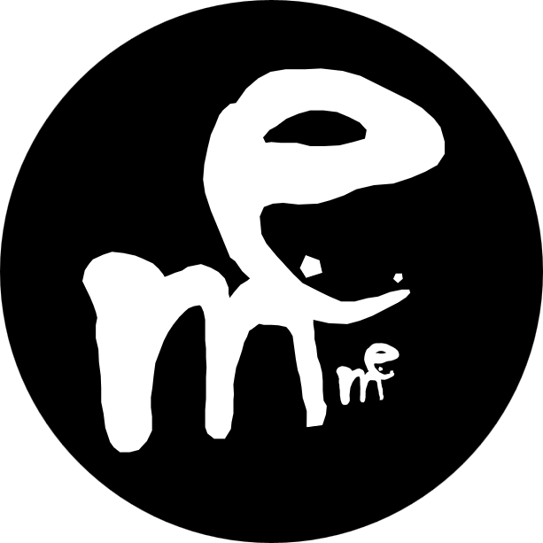
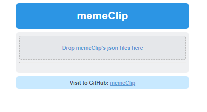
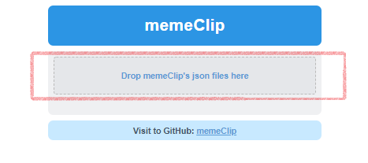
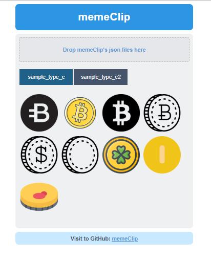

# memeClip

  

  

 

## memeClip 이란

- URL로 가지고 있는 짤방을 사용하기 편하게 해주는 SPA(Single Page Application) 입니다.
- 짤방을 *Drag&Drop* 또는 *Copy&Paste*를 이용해서 행아웃 등의 메신저에 편리하게 사용할 수 있습니다.
  (메신저에 따라 다르지만, 마치 스티커를 사용하는 것 처럼 사용하실 수 있습니다.)

## memeClip 사용법

### memeClip 접속

1. *memeClip*은 HTML 형태로 제공되는 SPA입니다.
1. 사용하시는 브라우저(*Google Crome*, *Microsoft Edge* 등)에서 <https://eminuk.github.io/memeClip/>에 접속합니다.
1. 최초 접속시에는 등록된 *짤방* 정보가 없어 빈 화면이 노출됩니다. (*짤방*정보를 따로 제공해 드리지 않습니다.)
  

### JSON 파일 생성

1. *memeClip*의 짤방은 JSON 파일로 관리 됩니다. 따라서 우선 JSON 파일을 생성 하셔야 합니다.  
  (참고: [sample.json](.sample.json))
1. JSON 파일 생성은 메모장 등의 프로그램을 이용하시면 됩니다.
1. JSON 파일은 아래 양식 대로 생성해 주시면 됩니다.
    1. *name* 항목은 짤방의 탭 이름으로 사용되며 사용자가 구분 할 수 있는 이름을 *String* 형태로 입력해 주시면 됩니다.
    1. *list* 항목에는 수집하신 *짤방*의 URL을 *Array* 형태로 입력해 주시면 됩니다.  
      (**짤방 사용시 저작권이 있는 이미지 사용을 주의해 주세요.**)
    ~~~ json
    [
        {
            "name": "sample_type_c",
            "list": [
                "https://eminuk.github.io/memeClip/sample/coin_01.png",
                "https://eminuk.github.io/memeClip/sample/coin_02.png",
                "https://eminuk.github.io/memeClip/sample/coin_03.png",
                "https://eminuk.github.io/memeClip/sample/coin_04.png",
                "https://eminuk.github.io/memeClip/sample/coin_05.png",
                "https://eminuk.github.io/memeClip/sample/coin_06.png",
                "https://eminuk.github.io/memeClip/sample/coin_07.png",
                "https://eminuk.github.io/memeClip/sample/coin_08.png",
                "https://eminuk.github.io/memeClip/sample/coin_09.png"
            ]
        },
        {
            "name": "sample_type_c2",
            "list": [
                "https://eminuk.github.io/memeClip/sample/coin_09.png",
                "https://eminuk.github.io/memeClip/sample/coin_08.png",
                "https://eminuk.github.io/memeClip/sample/coin_07.png",
                "https://eminuk.github.io/memeClip/sample/coin_06.png",
                "https://eminuk.github.io/memeClip/sample/coin_05.png",
                "https://eminuk.github.io/memeClip/sample/coin_04.png",
                "https://eminuk.github.io/memeClip/sample/coin_03.png",
                "https://eminuk.github.io/memeClip/sample/coin_02.png",
                "https://eminuk.github.io/memeClip/sample/coin_01.png"
            ]
        }
    ]
    ~~~

### JSON 파일 등록

1. 위에서 생성한 *JSON*파일을 페이지 상단 상단 *Drop zone*영역에 드래그&드랍 합니다.
    
1. JSON 파일 등록시 *짤방* 정보를 브라우저의 *Local Storage*에 저장합니다. 만약 이미 등록되어 있던 정보가 있다면 기존 정보는 손실됩니다.
1. 저장된 *짤방* 정보는 같은 브라우저로 재접속시 자동으로 로딩 됩니다.
    

### memeClip 사용

1. *memeClip*은 *Drag&Drop* 또는 *Copy&Paste* 두가지 방법으로 사용 가능합니다.
1. Drag&Drop
    - *memeClip*에서 원하는 *짤방*을 선택하고 메신져(행아웃 등)으로 드래그&드롭 하시면 전송 됩니다.
        (메신저 종류에 따라 지원되지 않을 수 있습니다.)
1. Copy&Paste
    - *memeClip*에서 원하는 *짤방*을 클릭하면 짤방의 URL이 클립보드로 복사됩니다. 이후 원하는 곳에서 *붙여넣기* 하시면 됩니다.

## 라이선스 정보

- Apache License 2.0

### 외부 리소스 및 참고 자료 정보

- <https://stackoverflow.com/questions/7346563/loading-local-json-file>
- <https://www.html5rocks.com/en/tutorials/file/dndfiles/>
- <https://iccpic.com/free-icons/coin>
- <https://hackernoon.com/copying-text-to-clipboard-with-javascript-df4d4988697f>
- <https://stackoverflow.com/questions/400212/how-do-i-copy-to-the-clipboard-in-javascript>
- <https://jquery.com/>
